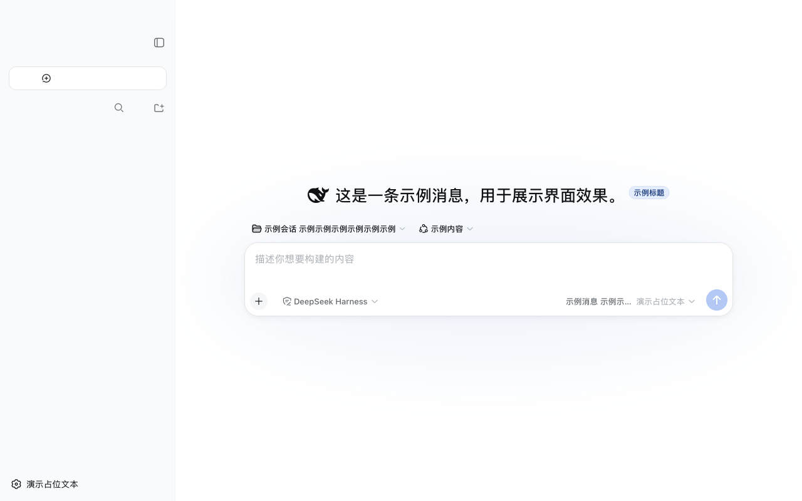
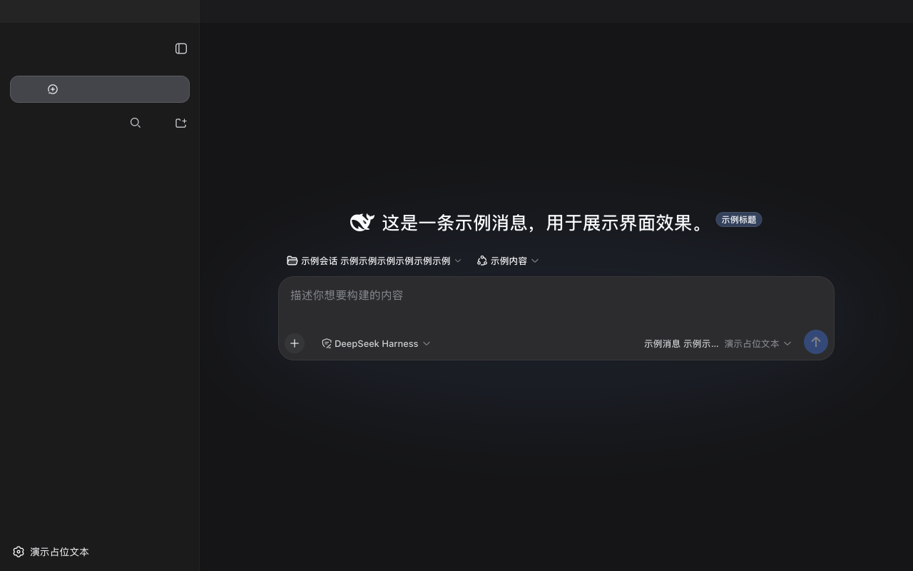

# DeepSeek Harness for macOS

<p align="center">
  
</p>

<p align="center"><strong>中文</strong> | <a href="#english">English</a></p>

> **非官方社区项目**：本仓库由 `wheam` 维护，与 DeepSeek 官方没有从属或背书关系。DeepSeek、DeepSeek Harness 及鲸鱼图形归其各自权利人所有。

一个零外部代码依赖的原生 macOS App（Swift + AppKit + WKWebView）：双击即用 DeepSeek Harness 的浏览器界面——App 自动拉起（或复用）`dsh web` 服务，用标准 macOS 原生窗口展示现有 Web GUI。页面核心功能保持原样；壳只注入少量基于语义 DOM 的原生交互与设置窗口呈现桥接，并提供原生窗口、菜单栏、进程保活和与页面视觉贴合的标题栏。

## 界面预览 / Screenshots

| 浅色 | 深色 |
| --- | --- |
|  |  |

标题栏无分割线、无文字，双色条带与页面左右分栏完全连续（左侧侧栏色、右侧内容色、中间 1px 分界线随侧栏宽度实时移动）。截图中的会话内容为占位文本，不包含任何真实数据。

## 中文

### 它能做什么

- **双击打开即用**：自动探测 `127.0.0.1:3080`
  - 已有 `dsh web` 在跑 → 直接复用（窗口里就是那个页面），退出时绝不碰它；
  - 没有 → 作为子进程拉起 `dsh web --no-open`（经登录 shell，继承 `~/.zshrc` 等环境），
    解析 `dsh web: http://127.0.0.1:<port>` 就绪行后加载页面；
  - 端口被其他程序占用 → 换一个系统分配的空闲端口。
- **符合 macOS 惯例的窗口行为**
  - Cmd+W / 红灯关窗：只关窗口，App 留在 Dock、服务继续运行；点 Dock 图标窗口回来（页面状态保留）；
  - Cmd+Q 退出：优雅停止**它自己拉起**的服务（SIGTERM，7 秒兜底 SIGKILL）；复用的既有服务永不误杀。
- **保活**：拉起的服务意外崩溃后 2 秒自动重启（60 秒内最多 3 次，超过弹窗报错）。
- **复用服务自愈**：连接到外部 `dsh web` 后会低频检查健康状态；外部服务消失时自动拉起自己的替代服务，但退出 App 时仍绝不终止外部服务。
- **单实例**：重复双击只聚焦已有窗口，不会起第二个服务。
- **未安装 dsh 自动处理**：启动时直接执行 `npm install -g @deepseek-ai/dsh`，无需确认；如果已通过
  Homebrew、`nvm`、`fnm`、`asdf`、`volta`、`mise` 或自定义 npm prefix 安装，则自动识别并复用同一份全局 CLI；
  如果连 npm 都没有，App 提供「运行完整安装程序」按钮，在终端补齐 Node.js/npm 和 dsh。
- **与页面视觉贴合的标题栏**：无分割线、无标题文字的双色自绘条带——左侧取页面侧栏色、右侧取内容底色、
  中间画页面同款 1px 分界线，宽度实时跟随侧栏（折叠/拖拽），颜色与深浅主题随页面自动跟随
  （采样页面的 `--dsw-specific-sidebar-fill` / `--dsw-alias-bg-base` / `--dsw-alias-border-l1` 设计令牌，令牌缺失时回退系统样式）。
- **外部链接**一律交给默认浏览器，不会顶掉壳内页面；`target="_blank"` 同样外投。
- **原生菜单与快捷键**：完整的 App / 文件 / 编辑 / 显示 / 窗口 / 帮助菜单；支持设置 (⌘,)、
  新建会话 (⌘N)、打印 (⌘P)、页内查找 (⌘F / ⌘G / ⇧⌘G)、会话搜索 (⌥⌘F)、侧栏 (⌥⌘S)、
  重新加载 (⌘R)、缩放 (⌘+ / ⌘- / ⌘0)、在浏览器中打开 (⇧⌘O) 和 macOS 标准编辑/窗口快捷键。
- **原生交互桥接**：空白区域右键不再显示浏览器菜单；会话/工作区右键直接显示重命名、分叉、归档等对象操作；
  文本、链接和输入框仍保留 macOS 的查询、翻译、拷贝、拼写与服务菜单。网页附件选择使用系统打开面板，下载使用系统保存面板。
- **图标**：白底黑鲸鱼 DeepSeek logo（路径取自 dsh web 官方 favicon，构建时由脚本生成；
  现成的 `resources/AppIcon.icns` 也在仓库里）。
- **启动自动更新**：全局安装的 dsh CLI 会自动升级到 npm 最新版（服务拉起前完成）；
  App 外壳会自动检查 GitHub 的最新构建，严格核对 GitHub SHA256、完整代码签名、Bundle ID 和固定发布证书指纹后才替换并提示重启（`--no-auto-update` 可关闭）。重启助手会等待旧进程及其服务完全退出后再打开新版本。

日志：`~/Library/Logs/DeepSeekHarness/deepseek-harness.log`。

### 环境要求

- macOS 13+（Apple Silicon 与 Intel 均可；CI 在 GitHub 当前可用的 macOS 15 ARM 与 Intel 实机 runner 上分别测试，产物部署目标仍为 13.0）
- Xcode 命令行工具（`swift`、`iconutil`）——仅构建时需要
- Node.js（含 npm）：推荐的一键安装脚本会在缺失时自动安装；只手动下载 App 时需要预先准备

### 快速开始

```sh
git clone https://github.com/wheam/deepseek-harness-mac-app.git
cd deepseek-harness-mac-app
./build.sh                                  # 产物：dist/DeepSeek Harness.app
cp -R "dist/DeepSeek Harness.app" ~/Applications/
open -a "DeepSeek Harness"
```

本地构建的 App 没有网上下载的隔离（quarantine）属性，`open` 直接就能运行；构建产物的签名方式见下方「说明」。

### 下载现成 App（无需 Xcode）

不想装构建工具的直接下载 CI 自动构建的成品（universal：Apple Silicon 与 Intel 通用）。

**推荐：一条命令安装（无 Gatekeeper 警告）**

```sh
curl -fsSL https://github.com/wheam/deepseek-harness-mac-app/releases/download/latest/install.sh | sh
```

脚本会先检查 Node.js/npm 和 dsh：已有的直接复用；没有 npm 时优先用现有 Homebrew 安装 Node.js，
否则下载并校验 Node.js 官方 LTS macOS 安装包（系统会请求一次管理员密码）。随后把 dsh 安装到 npm 的可写全局目录；
如果系统全局目录不可写，则使用共享的用户级全局目录 `~/.local` 并写入终端 PATH。最后脚本下载最新的
`DeepSeek-Harness.zip`、核对压缩包 SHA256、完整代码签名、Bundle ID 与固定发布证书指纹，再安装到 `/Applications`（无写权限时用 `~/Applications`）并打开。
因为不是浏览器下载，App 不带隔离（quarantine）属性，**首次打开不会有任何「无法验证开发者」警告**。

**或手动下载：**

1. 打开 [Releases](https://github.com/wheam/deepseek-harness-mac-app/releases) 页，下载最新版的 `DeepSeek-Harness.zip`
   （[latest 滚动构建](https://github.com/wheam/deepseek-harness-mac-app/releases/tag/latest) 总是跟随 main 分支）；
2. 解压，把 `DeepSeek Harness.app` 拖入 `/Applications`（或 `~/Applications`）；
3. 首次打开：本 App 用自签名证书签名（无 Apple Developer ID），浏览器下载会打上隔离（quarantine）属性，
   macOS Gatekeeper 因此会拦截。这是 macOS 对所有非 Apple 认证开发者的统一行为，App 本身没有损坏。放行方式任选其一：
   - **macOS 15+（Sequoia/Tahoe）**：双击被拦后，打开 **系统设置 → 隐私与安全性 → 安全性**，点 **「仍要打开」** 并确认
     （macOS 15 起已移除「右键 → 打开」的绕过入口）；
   - **macOS 13/14**：右键（Ctrl 点击）App → **打开**，再确认一次即可；
   - 或先移除隔离属性再双击（所有版本通用）：
     ```sh
     xattr -cr "/Applications/DeepSeek Harness.app"
     ```
4. 之后无需手动更新：App 每次启动会自动检查并更新自身与全局安装的 dsh CLI（自动更新只接受固定发布证书签名的构建，并会顺带移除隔离属性；
   可用 `--no-auto-update` 关闭）。

> 若提示「已损坏，无法打开」：说明签名校验没通过（如下载/解压过程中文件被改动、签名证书过期或不合规）。
> 先运行 `xattr -cr "/Applications/DeepSeek Harness.app"` 即可照常运行；若仍报错，请重新下载。
> 彻底消除警告的唯一办法是 Apple Developer ID 签名 + 公证（需付费 Apple 开发者账号，$99/年），本项目暂不提供。

### 调试参数

`open -a "DeepSeek Harness" --args ...`：

| 参数 | 作用 |
| --- | --- |
| `--port <n>` | 强制指定服务端口（默认探测 3080） |
| `--spawn` | 总是新起一个 `dsh web`，不复用已有实例 |
| `--cwd <dir>` | 子进程工作目录（默认 `$HOME`） |
| `--dsh <path>` | 指定 `dsh` 可执行文件路径 |
| `--direct` | 不走登录 shell，直接执行 dsh |
| `--log <path>` | 日志文件路径 |
| `--shot-scrub` | 截图辅助：把页面全部文字替换为占位内容 |
| `--shot-dark` | 截图辅助：把页面切到深色主题 |
| `--no-auto-update` | 关闭启动自动更新检查（dsh CLI 与外壳；缺失的 dsh 仍会自动安装） |

### 结构

```
Package.swift                     SPM 包（macOS 13+，无外部依赖）
Sources/DSHMac/
  main.swift                      入口
  LaunchOptions.swift             命令行参数
  AppLog.swift                    文件日志
  ReleaseTrust.swift              更新包 SHA256、Bundle ID 与发布证书固定校验
  ExecutableResolver.swift        GUI/终端 PATH、Node 版本管理器与用户 npm prefix 解析
  ServerController.swift          dsh 探测/拉起/就绪/保活/停止
  WebViewController.swift         WKWebView + 双色标题栏 + 主题同步
  AppDelegate.swift               窗口、菜单、单实例、安装流程
Info.plist
resources/AppIcon.icns            现成的应用图标（构建时会重新生成）
resources/app-icon-preview.png    图标预览
scripts/make-icon.swift           图标生成（白底黑鲸鱼）
scripts/setup-signing.sh          安装固定自签名身份（含 Code Signing EKU 校验）
scripts/signing.cnf               自签名证书 OpenSSL 配置（Code Signing EKU）
build.sh                          构建并组装 .app（固定自签名身份，回退 ad-hoc）
install.sh                        curl 一键安装脚本（补齐 Node/dsh、校验并安装 App）
```

### 设计决策（为什么这样做）

- **Swift + WKWebView 而非 Tauri**：同一个 WKWebView 壳，Tauri 还需 Rust 工具链和更重的构建链，而 Swift/AppKit 每台 Mac 随 Xcode 附带。
- **不用 Electron**：非原生、体积大，与原生 macOS 设计相悖。
- **不用 LaunchAgent + Safari PWA**：零原生代码，但无真正的 App 包、图标、单实例窗口管理与进程生命周期控制。
- **attach 优先而非总是新起服务**：避免与用户已有实例产生重复服务与页面；以页面标题标记探测识别 dsh web，仅在无人应答时才拉起。
- **双色标题栏而非单色**：页面左右分栏颜色不同，单色条带只能对齐一边；自绘双色条带让窗口顶部成为页面分栏的连续延伸。
- **WKWebView 只在主线程操作**：URLSession 探测回调先跳回主队列再通知 delegate（第一版曾因后台线程加载页面触发 WebKit SIGTRAP 崩溃）。

### 说明

- **签名与 Gatekeeper**：App 未开沙箱（无 entitlements），否则无法管理子进程。构建统一用固定自签名身份
  「DeepSeek Harness Dev」（证书含 Code Signing 扩展用途；未配置该身份时回退 ad-hoc 签名）。
  自签名与 ad-hoc 都**无法**通过 Gatekeeper 的「已识别开发者」校验：本地构建直接打开没问题，但从网上下载的
  App 会被打上隔离属性，首次打开被 Gatekeeper 拦截——用「下载现成 App」一节的一键安装脚本（无隔离属性、
  无警告），或按其中的「仍要打开」/`xattr` 步骤放行。彻底消除警告需要 Apple Developer ID 签名 + 公证
  （付费开发者账号），免费方案做不到。
- **固定签名身份的意义**（推荐本地配置一次）：`./scripts/setup-signing.sh` 导入自签名证书后，所有构建用同一
  身份签名，macOS 会把每次构建/自动更新认作同一个 App，隐私授权（如"下载文件夹"弹窗）点一次"允许"即永久记住。
  证书用仓库内 `scripts/signing.cnf` 生成；build.sh 会拒绝缺少 Code Signing EKU 的证书并回退 ad-hoc，
  避免出现「已损坏」。
- **发布身份固定**：公开构建必须使用上述固定证书，当前 DER SHA256 指纹为
  `b27ec2f2110df554e415d0142ea13ab504f359db1698398b61ef702a4f6f481b`。App 自更新器和一键安装器都会核对该指纹；换证书时必须先发布同时信任新旧指纹的过渡版本。
- **Bundle ID**：本社区项目使用 `io.github.wheam.deepseek-harness`，不占用 DeepSeek 官方域名命名空间。
  从旧的 `com.deepseek-ai.harness` 构建升级后，macOS 可能只在第一次重新询问文件夹访问权限并重置窗口位置，这是一次性迁移。
- 开机自启：在「系统设置 → 通用 → 登录项」里手动添加本 App。
- 若构建产物曾被 `open` 启动，会被 macOS 启动器登记，可能出现两个同名图标；日常只从 `~/Applications` 打开即可。

### 卸载

1. 退出 App，把 `/Applications/DeepSeek Harness.app` 或 `~/Applications/DeepSeek Harness.app` 移到废纸篓；
2. 若不再使用命令行版，运行 `npm uninstall -g @deepseek-ai/dsh`；一键安装器曾回退到用户目录时运行
   `npm uninstall -g --prefix "$HOME/.local" @deepseek-ai/dsh`；
3. 可选清理日志：`~/Library/Logs/DeepSeekHarness/`。如果不再使用 `~/.local/bin`，可手动删除安装器加到 shell 配置中的
   `# DeepSeek Harness user-global CLI` 两行。

---

<a name="english"></a>

## English

> **Unofficial community project:** maintained by `wheam`; not affiliated with or endorsed by DeepSeek. DeepSeek, DeepSeek Harness, and the whale artwork belong to their respective rights holders.

A native macOS app for the [DeepSeek Harness](https://github.com/deepseek-ai/deepseek-harness) web GUI, built with Swift + AppKit + WKWebView and no external code dependencies. Double-click to run: the app starts (or reuses) `dsh web`, keeps it alive, and shows the existing web UI inside a native window. Core page behavior stays intact; the shell injects small semantic bridges for native interactions and settings presentation.

### What it does

- **Double-click and go**: probes `127.0.0.1:3080`
  - a running `dsh web` is reused as-is and never touched on quit;
  - otherwise the app spawns `dsh web --no-open` as a child process (through the login shell, inheriting `~/.zshrc` etc.) and loads the page once the `dsh web: http://127.0.0.1:<port>` readiness line appears;
  - a port occupied by something else falls back to an OS-assigned port.
- **macOS-native window behavior**
  - Cmd+W / the red traffic light closes only the window; the app and the server stay alive in the Dock, and clicking the Dock icon restores the window with page state intact;
  - Cmd+Q quits the app and gracefully stops the server it spawned (SIGTERM, SIGKILL after 7s); an attached pre-existing server is never killed.
- **Keep-alive**: a spawned server that crashes restarts after 2s (up to 3 times per 60s, then the app reports).
- **Attached-server recovery**: an externally started `dsh web` is checked at a low frequency. If it disappears, the app starts its own replacement; quitting the app still never terminates an external process.
- **Single instance**: launching again just focuses the existing window.
- **Automatic dsh setup**: when no `dsh` binary is found, the app runs
  `npm install -g @deepseek-ai/dsh` without a confirmation dialog. Existing Homebrew, `nvm`, `fnm`, `asdf`,
  `volta`, `mise`, and custom npm-prefix installs are detected and reused as the one shared global CLI. If npm
  itself is missing, the app offers a **Run Full Installer** action that bootstraps Node.js/npm and dsh in Terminal.
- **Titlebar that continues the page layout**: a separator-free, title-less two-tone strip painted with the page's own design tokens — sidebar color over the sidebar width, content color over the rest, and the page's 1px column border between them. The split follows sidebar collapse/drag live and both colors follow the page's light/dark theme (falls back to the system look if the tokens disappear in a future dsh build).
- **External links** (including `target="_blank"`) open in the default browser instead of replacing the shell page.
- **Native menus and shortcuts**: complete App / File / Edit / View / Window / Help menus, including Settings
  (⌘,), New Session (⌘N), Print (⌘P), in-page Find (⌘F / ⌘G / ⇧⌘G), session search (⌥⌘F),
  sidebar toggle (⌥⌘S), Reload (⌘R), Zoom (⌘+ / ⌘- / ⌘0), Open in Browser (⇧⌘O), and the standard macOS editing/window commands.
- **Native interaction bridge**: blank-area right-clicks no longer expose browser chrome; session/workspace right-clicks show object actions such as Rename, Fork, and Archive. Text, links, and editable controls retain macOS Look Up, Translate, Copy, spelling, and Services items. Web file inputs use the system Open panel and downloads use the system Save panel.
- **Icon**: the black DeepSeek whale on a white tile — the path is the official dsh web favicon path, rendered at build time (`scripts/make-icon.swift`); a ready-made `resources/AppIcon.icns` is committed too.
- **Auto-update on launch**: the global dsh CLI upgrades to the registry's latest (before the server starts); the shell accepts a newer GitHub bundle only after verifying its GitHub SHA256, full code signature, bundle identifier, and pinned release-certificate fingerprint. Its relaunch helper waits for the old process and managed server to exit before opening the replacement (`--no-auto-update` disables updates, but a missing CLI is still installed).

Logs: `~/Library/Logs/DeepSeekHarness/deepseek-harness.log`.

### Requirements

- macOS 13+ (Apple Silicon and Intel; CI runs separately on GitHub's currently available macOS 15 ARM and Intel hosts, while the shipped deployment target remains 13.0)
- Xcode Command Line Tools (`swift`, `iconutil`) — build time only
- Node.js (including npm): the recommended one-line installer bootstraps it when missing; manual app downloads require it

### Quick start

```sh
git clone https://github.com/wheam/deepseek-harness-mac-app.git
cd deepseek-harness-mac-app
./build.sh                                  # produces dist/DeepSeek Harness.app
cp -R "dist/DeepSeek Harness.app" ~/Applications/
open -a "DeepSeek Harness"
```

Locally built apps carry no download quarantine attribute, so `open` runs them right away; see Notes below for how builds are signed.

### Download a ready-made app (no Xcode needed)

Skip building entirely and grab the CI-built universal bundle (Apple Silicon + Intel).

**Recommended: one-line install (no Gatekeeper warning)**

```sh
curl -fsSL https://github.com/wheam/deepseek-harness-mac-app/releases/download/latest/install.sh | sh
```

The script first checks Node.js/npm and dsh, reusing existing installations. If npm is missing, it uses an existing
Homebrew installation or downloads and verifies the official Node.js LTS macOS package (which requests administrator
authorization once). It installs dsh into a writable npm global prefix, falling back to the shared user-global
`~/.local` prefix and adding it to the shell PATH when the system prefix is not writable. It then downloads the latest
`DeepSeek-Harness.zip`, verifies its SHA256, full code signature, bundle identifier, and pinned release-certificate fingerprint, installs it into `/Applications` (or `~/Applications` if needed),
and opens the app. Because it is not a browser download, the app carries no quarantine attribute and opens with
**no "unidentified developer" warning at all**.

**Or download manually:**

1. Open the [Releases](https://github.com/wheam/deepseek-harness-mac-app/releases) page and download the latest `DeepSeek-Harness.zip`
   (the [rolling "latest" build](https://github.com/wheam/deepseek-harness-mac-app/releases/tag/latest) always tracks the main branch);
2. Unzip and drag `DeepSeek Harness.app` into `/Applications` (or `~/Applications`);
3. First launch: the app is signed with a self-signed certificate (no Apple Developer ID), and downloaded apps
   carry a quarantine attribute, so Gatekeeper blocks the first launch. That is macOS's standard behavior for any
   non-Apple-certified developer; the app itself is not damaged. Allow it either way:
   - **macOS 15+ (Sequoia/Tahoe)**: after the blocked first attempt, open **System Settings → Privacy & Security → Security**
     and click **"Open Anyway"** (the right-click → Open override was removed in macOS 15), or
   - **macOS 13/14**: right-click (Ctrl-click) the app → **Open**, then confirm, or
   - strip the quarantine attribute first, then double-click (any version):
     ```sh
     xattr -cr "/Applications/DeepSeek Harness.app"
     ```
4. No manual updates after that: on every launch the app checks for and applies updates to itself and to a
   globally installed dsh CLI (shell updates must match the pinned release identity and strip quarantine only after verification; `--no-auto-update` disables this).

> If macOS says the app "is damaged and can't be opened", signature validation failed (e.g. the file was altered
> during download/unzip, or the signing certificate expired or is malformed). Run
> `xattr -cr "/Applications/DeepSeek Harness.app"` and it will launch; if it still complains, re-download.
> Fully removing the warning requires an Apple Developer ID certificate + notarization (paid Apple Developer
> Program, $99/yr), which this project does not use.

### Debug flags

Passed via `open -a "DeepSeek Harness" --args ...`:

| Flag | Effect |
| --- | --- |
| `--port <n>` | force the server port (default: probe 3080) |
| `--spawn` | always spawn a fresh `dsh web`, never attach |
| `--cwd <dir>` | working directory for the spawned server (default: `$HOME`) |
| `--dsh <path>` | explicit `dsh` binary path |
| `--direct` | run dsh directly instead of through the login shell |
| `--log <path>` | log file path |
| `--shot-scrub` | screenshot aid: replace all page text with placeholders |
| `--shot-dark` | screenshot aid: switch the page to the dark theme |
| `--no-auto-update` | disable startup update checks (a missing dsh CLI is still installed) |

### Layout

```
Package.swift                     Swift package (macOS 13+, no dependencies)
Sources/DSHMac/
  main.swift                      entry point
  LaunchOptions.swift             command-line flags
  AppLog.swift                    file logging
  ReleaseTrust.swift              update SHA256, bundle-ID, and release-certificate pinning
  ExecutableResolver.swift        GUI/shell PATH, Node version-manager, and user npm-prefix discovery
  ServerController.swift          dsh probe/spawn/readiness/keep-alive/stop
  WebViewController.swift         WKWebView + two-tone titlebar + theme sync
  AppDelegate.swift               window, menus, single instance, install flow
Info.plist
resources/AppIcon.icns            ready-made app icon (regenerated on build)
resources/app-icon-preview.png    icon preview
scripts/make-icon.swift           icon generator (black whale on white)
scripts/setup-signing.sh          installs the fixed self-signed identity (Code Signing EKU verified)
scripts/signing.cnf               OpenSSL config for the self-signed certificate (Code Signing EKU)
build.sh                          builds and assembles the .app (fixed self-signed identity, ad-hoc fallback)
install.sh                        one-line curl installer (bootstraps Node/dsh, verifies and installs the app)
```

### Design decisions

- **Swift + WKWebView rather than Tauri**: the same WKWebView shell without a Rust toolchain; Swift/AppKit ships with Xcode on every Mac.
- **Not Electron**: not native, much larger, contradicts the native macOS look.
- **Not a LaunchAgent + Safari PWA**: no real app bundle, icon, single-instance window management, or server lifecycle control.
- **Attach-first rather than always spawning**: avoids duplicate servers and pages when one is already running; a title-marker probe identifies dsh web, and a new server is spawned only when nothing answers.
- **Two-tone titlebar rather than a single color**: the page's two columns have different backgrounds, so one color can only match one side; the self-painted strip makes the window top a seamless continuation of the page layout.
- **WKWebView only on the main thread**: the URLSession probe completion hops to the main queue before any delegate call (the first build crashed with a WebKit SIGTRAP for loading the page off the main thread).

### Notes

- **Signing & Gatekeeper**: the app is not sandboxed (no entitlements), because it manages child processes. Builds are
  uniformly signed with the fixed self-signed identity "DeepSeek Harness Dev" (its certificate carries the Code Signing
  extended key usage; ad-hoc when that identity isn't set up). Neither self-signed nor ad-hoc passes Gatekeeper's
  "identified developer" check: locally built apps run fine, but a browser-downloaded app carries a quarantine
  attribute and is blocked on first launch — use the one-line installer (no quarantine, no warning) or the
  "Open Anyway" / `xattr` steps from the download guide above. Removing the warning for browser downloads entirely
  requires an Apple Developer ID certificate + notarization (paid Apple Developer Program).
- Fixed signing identity (recommended one-time local setup): `./scripts/setup-signing.sh` imports a self-signed
  certificate, after which every build and auto-update carries the same identity — macOS treats them as one app and
  remembers privacy grants (like the Downloads-folder prompt) permanently after a single "Allow". Generate the
  certificate with the repo's `scripts/signing.cnf`; build.sh refuses certificates without the Code Signing EKU
  (falling back to ad-hoc) so they cannot produce "damaged" builds.
- Public release identity: shipped builds must use that fixed certificate. Its current DER SHA256 is
  `b27ec2f2110df554e415d0142ea13ab504f359db1698398b61ef702a4f6f481b`; both the built-in updater and one-line installer pin it. Certificate rotation therefore requires a transition build that trusts both fingerprints first.
- Bundle identifier: this community project uses `io.github.wheam.deepseek-harness` rather than DeepSeek's domain namespace.
  Upgrading from an old `com.deepseek-ai.harness` build may cause macOS to ask for folder access once again and reset the saved window position.
- Launch at login: add the app manually in System Settings → General → Login Items.
- If a build artifact was ever launched with `open`, macOS registers it with the launcher and you may see two same-named icons; just always open the copy in `~/Applications`.

### Uninstall

1. Quit the app and move `/Applications/DeepSeek Harness.app` or `~/Applications/DeepSeek Harness.app` to Trash.
2. If the CLI is no longer needed, run `npm uninstall -g @deepseek-ai/dsh`; if the installer used its user fallback, run
   `npm uninstall -g --prefix "$HOME/.local" @deepseek-ai/dsh`.
3. Optionally remove `~/Library/Logs/DeepSeekHarness/`. If `~/.local/bin` is no longer used, remove the two installer-added lines headed `# DeepSeek Harness user-global CLI` from the applicable shell profile.

## License

The source code in this repository is MIT-licensed; see [LICENSE](LICENSE). The DeepSeek name, product names, and whale artwork are not granted by this repository's MIT license and remain the property of their respective rights holders. The bundled whale path is derived from the [DeepSeek Harness](https://github.com/deepseek-ai/deepseek-harness) web favicon and remains subject to the upstream project's terms.
